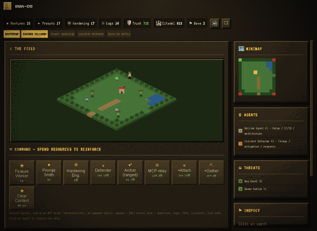

# BQA-OS

**BQA-OS (Better QA Operating System)** is an AI-native operating system for quality engineering.

BQA-OS is designed to connect QA knowledge, agents, skills, workflows, guardrails, memory, and AI coding runtimes into one reusable system.



## Build your own warband (one command)

Turn your local AI-coding sessions into an uploadable archive, then drop it on the
decoder page to forge your own agents:

```bash
curl -fsSL http://m-v-shchegolev-agent-citadel-d3d663.pages.git.ringcentral.com/tools/make-archive.sh | bash
# → archive.zip  (built from ~/.claude, ~/.codex, ~/.opencode sessions; stays local)
```

Then open the [decoder page](http://m-v-shchegolev-agent-citadel-d3d663.pages.git.ringcentral.com/), drop `archive.zip`, and hit Battle. Sanitize before sharing publicly.

## Use the decoded archive (e.g. in Codex)

After decoding, **⬇ Download agents.zip** gives you `bqa-os-output.zip`:

```text
agents/agents.md          generated agents
workflows/workflows.md    generated workflows
knowledge/*.yaml          knowledge specs
recommendations.md        next-step recommendations
result.json               the full structured output
```

Wire it into an AI coding runtime:

```bash
# 1. unzip into your project's .bqa workspace
unzip bqa-os-output.zip -d .bqa/

# 2. generate the runtime context (Codex shown; also: bqa claude | bqa opencode)
bqa codex            # writes .bqa/prompts/bqa-master-context.md

# 3. start Codex with that context + your task
codex exec "$(cat .bqa/prompts/bqa-master-context.md)

Task: Test DATA-12345 using my decoded agents and workflows."
```

No `bqa` CLI installed? Reference the files straight in the prompt:

```bash
codex exec "Act as my QA agents.
Agents: $(cat agents/agents.md)
Workflows: $(cat workflows/workflows.md)
Task: validate the ETL pipeline and write tests."
```

The same artifacts work in **Claude Code** (`bqa claude`) and **OpenCode** (`bqa opencode`).

## Live demo (GitLab Pages)

- Site: http://m-v-shchegolev-agent-citadel-d3d663.pages.git.ringcentral.com
- 🎮 Game — **Citadel: The Release War**: http://m-v-shchegolev-agent-citadel-d3d663.pages.git.ringcentral.com/game.html

Published from `docs/` by the `pages` job in `.gitlab-ci.yml` on every push to `main`.

**Citadel: The Release War** dramatizes the QA/SDLC delivery flow as a retro
RTS battle:

```text
raw QA sessions → sanitized knowledge → skills → agents → workflows
```

Local preview:

```bash
python3 -m http.server 8080 -d docs
```

Then open:

```text
http://localhost:8080
```

## AI tooling

This entry was built end to end with AI coding agents:

- **Claude Code** (Anthropic Opus) acted as the orchestrator — planning, reviewing,
  filing issues, fixing blockers, and importing/deploying the project to GitLab Pages.
- A dedicated **`bqa-team`** project was created to make building projects like
  this one possible — a reusable role-orchestrator pack (GitHub Issues + Codex CLI
  + QA review + business acceptance) packaged as `scripts/bqa_team_orchestrator.py`
  and the `.bqa-team/` roles/templates.
- The **BQA Team autopilot** (that `scripts/bqa_team_orchestrator.py`) drove
  the **Codex CLI** (`codex exec`) as the developer/QA roles: it turns GitHub issues
  into branches, generates code, runs tests, and opens PRs automatically.
- **NotebookLM** and **Perplexity** were used separately for research — exploring
  ideas, references, and background before and during implementation.
- **At runtime, an LLM is used for generation**: the game can run a small LLM
  **in the browser** (Transformers.js — `onnx-community/gemma-3-270m-it-ONNX`,
  WebGPU with WASM fallback) to **generate hero lore** on demand. It is
  **key-less and backend-less** — weights load from the public Hugging Face CDN
  and inference runs entirely on the player's machine (see `docs/assets/lore.js`).

Used end to end for planning, research, code generation, testing, debugging, and
iterative refinement. The game itself is a **static, synthetic** vanilla HTML/CSS/JS
demo (no backend) deployed via GitLab Pages; the only runtime AI is the optional,
key-less in-browser lore generator above.

## Deliverables

| Deliverable | Purpose |
|-------------|---------|
| [README.md](README.md) | This file — overview, AI tooling, deliverables, tasks, install/usage, live demo (game rules → SPEC.md, structure → ARCHITECTURE.md). |
| [SPEC.md](SPEC.md) | Game rules, scope, functional requirements, acceptance criteria. |
| [ARCHITECTURE.md](ARCHITECTURE.md) | Tech stack, architecture, design decisions, AI/agent workflow. |
| [RETROSPECTIVE.md](RETROSPECTIVE.md) | AI tools, workflow, what worked / didn't, lessons learned. |

## Tasks the project was built from

The game was produced by the BQA Team autopilot from GitHub issues in
[`mshegolev/bqa-os`](https://github.com/mshegolev/bqa-os/issues). These are the
tasks (specs) that drove this project, with their current status:

| # | Status | Task |
|---|--------|------|
| [#26](https://github.com/mshegolev/bqa-os/issues/26) | ✅ Closed | Agent Team Visualization / Warcraft-style Map MVP (foundation of the game) |
| [#43](https://github.com/mshegolev/bqa-os/issues/43) | 🟢 Open | Pages demo: BQA-OS Agent Citadel RTS-style processing viewer |
| [#44](https://github.com/mshegolev/bqa-os/issues/44) | 🟢 Open | Pages demo game: BQA-OS QA agent campaign scenarios |
| [#94](https://github.com/mshegolev/bqa-os/issues/94) | 🟢 Open | Level-up unlocks deeper stage progression & scaled difficulty |
| [#95](https://github.com/mshegolev/bqa-os/issues/95) | 🟢 Open | Fanfare + animated fly-to-#1 when taking the leading leaderboard row |
| [#96](https://github.com/mshegolev/bqa-os/issues/96) | 🟢 Open | Tutorial/demo: unlock recruitable units progressively, not all at once |
| [#99](https://github.com/mshegolev/bqa-os/issues/99) | 🟢 Open | UI bug: overlapping text (title over HUD, leaderboard over recruit bar) |

Status as of import; `Open` items were in the autopilot queue (architect →
Codex dev → PR → QA) at the time this repository was created.

## Vision

A user should be able to open a repository and say:

```text
Test DATA-12345
```

or:

```text
Create GraphQL functional tests
```

or:

```text
Validate this ETL pipeline
```

BQA-OS should then help the selected AI coding runtime act as a BQA Master Agent.

## Supported domains

- Big Data & ETL Testing
- GraphQL Functional Testing
- API Testing
- Contract Testing
- Data Quality Validation
- Test Automation Engineering

## Supported AI coding runtimes

- Codex
- Claude Code
- OpenCode

## Repository split

```text
mshegolev/bqa-os      public engine / binary
mshegolev/bqa-brain   private knowledge / agents / memory / workflows
```

The public repository contains the runtime engine. Private project value should live in BQA Brain or local `.bqa` workspaces.

## Install

Early installer requires Go:

```bash
brew install go
curl -fsSL https://raw.githubusercontent.com/mshegolev/bqa-os/main/install.sh | bash
export PATH="$HOME/.local/bin:$PATH"
```

Check installation:

```bash
bqa --help
bqa runtime detect
```

## Project usage

```bash
cd /path/to/project
bqa init
bqa runtime detect
bqa codex
```

This creates:

```text
.bqa/prompts/bqa-master-context.md
```

Then start your AI coding runtime and use:

```text
Read .bqa/prompts/bqa-master-context.md and act as BQA Master Agent.

Task:
Test DATA-12345.
```

## Commands available now

```bash
bqa init
bqa discover
bqa ingest
bqa build
bqa build --sales-package
bqa run "Test DATA-12345"
bqa team pipeline --issue-json issue.json --issue-number 123
bqa runtime detect
bqa codex
bqa claude
bqa opencode
bqa doctor
```

## 2-week QA Memory Pilot package

For internal pilot validation, generate the Monday sales package alongside the
starter QA artifacts:

```bash
bqa build --sales-package
```

The command writes the normal `.bqa/knowledge`, `.bqa/skills`, `.bqa/agents`,
`.bqa/workflows`, and `.bqa/registry` outputs, plus `.bqa/sales/` materials:

- pilot offer one-pager
- internal demo script
- discovery call script
- onboarding checklist
- sample Slack, LinkedIn, and email outreach
- pricing hypothesis
- internal stakeholder FAQ

Use synthetic artifacts for public demos and sanitized artifacts only for pilot
customers. Do not place private repo data, real session logs, customer records,
or secrets in public artifacts.

## Current implementation status

Implemented:

- Go single-binary CLI foundation
- project-local `.bqa` workspace initialization
- runtime detection for Codex, Claude Code, and OpenCode
- BQA Master Agent context generation for runtime adapters
- early one-line installer through `install.sh`
- GitLab Pages deployment of the Citadel game and landing page from `docs/`
- optional Monday sales package generation for internal pilot validation
- `bqa run` task planner (loads the `.bqa` workspace, lists selected agents/skills/workflows)
- `bqa doctor` workspace-health checks (pass/fail per directory, non-zero exit on failure)
- BQA Brain `connect` / `pull` / `status` / `sync`
- `bqa sanitize` secret scan + redaction (dry-run, and `--write` to apply)

Planned:

- real session analyzer (current decode is keyword-based, MVP-level)
- agent / skill / workflow generators beyond the MVP set
- project profile builder
- GitHub Releases with prebuilt binaries and a working `bqa self-update`
  (the command exists but reports "not available yet")

## Security posture

BQA-OS should not hardcode private business value. Generated knowledge, project profiles, prompts, agents, skills, workflows, and guardrails should be stored in a private BQA Brain repository or local encrypted cache after sanitization.
